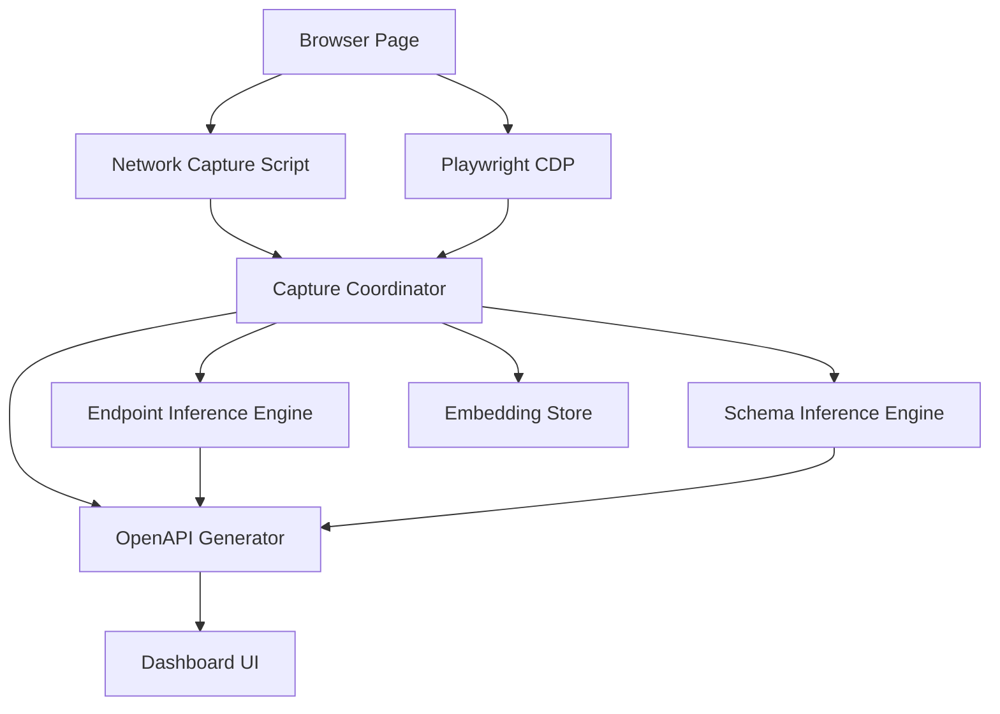
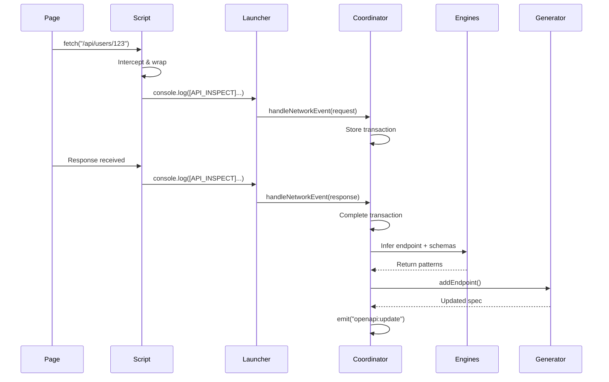

PlayCapture is built with a modular architecture that separates concerns across specialized components. This page explains how each piece fits together.

## System overview



## Core components

### Browser launcher

**Location:** `src/dev-tools/core/browser-launcher.ts`

Manages the Playwright browser instance and coordinates all browser-level operations.

<AccordionGroup>
  <Accordion title="Responsibilities">
    - Launch Chromium with appropriate flags
    - Create isolated browser contexts
    - Inject capture hooks before page load
    - Forward captured events to coordinator
    - Handle graceful shutdown
  </Accordion>
  <Accordion title="Configuration options">
    ```typescript
    interface BrowserLauncherOptions {
      headless: boolean;           // Visibility mode
      coordinator: CaptureCoordinator; // Event handler
      fullCapture?: boolean;       // Enable Playwright capture
    }
    ```
  </Accordion>
</AccordionGroup>

The launcher uses Playwright's `addInitScript()` to inject hooks before any page content loads:

```typescript
await this.page.addInitScript(NETWORK_CAPTURE_SCRIPT);
await this.page.goto(targetUrl, { waitUntil: "domcontentloaded" });
```

### Capture coordinator

**Location:** `src/dev-tools/core/capture-coordinator.ts`

The central hub that orchestrates all capture and inference operations.

<CardGroup cols={2}>
  <Card title="Event normalization" icon="filter">
    Receives events from multiple sources (injected script, Playwright) and normalizes them into a consistent format
  </Card>
  <Card title="Transaction management" icon="database">
    Maintains in-memory map of request/response pairs, matching responses to requests by ID
  </Card>
  <Card title="Pipeline orchestration" icon="gears">
    Coordinates the three inference engines and triggers OpenAPI updates
  </Card>
  <Card title="Event broadcasting" icon="tower-broadcast">
    Extends EventEmitter to notify connected clients of spec updates
  </Card>
</CardGroup>

#### Data structures

The coordinator works with three key interfaces:

```typescript
interface NetworkRequest {
  id: string;
  url: string;
  method: string;
  headers: Record<string, string>;
  body: any;
  timestamp: number;
}

interface NetworkResponse {
  id: string;
  status: number;
  statusText: string;
  headers: Record<string, string>;
  body: any;
  duration?: number;
}

interface NetworkTransaction {
  request: NetworkRequest;
  response: NetworkResponse | null;
  completedAt: number | null;
}
```

#### Processing flow

When a complete transaction is ready (see `src/dev-tools/core/capture-coordinator.ts:179`):

<Steps>
  <Step title="Endpoint inference">
    Extract URL pattern and detect path parameters
    ```typescript
    const endpoint = this.endpointEngine.inferEndpoint({
      url: request.url,
      method: request.method
    });
    ```
  </Step>
  <Step title="Schema inference">
    Generate JSON schemas for request and response bodies
    ```typescript
    const schemas = await this.schemaEngine.inferSchemas({
      requestBody: request.body,
      responseBody: response.body,
      contentType: response.headers["content-type"]
    });
    ```
  </Step>
  <Step title="OpenAPI update">
    Add endpoint to specification with inferred schemas
    ```typescript
    this.openapiGenerator.addEndpoint({
      endpoint,
      method: request.method,
      requestSchema: schemas.request,
      responseSchema: schemas.response,
      headers: request.headers,
      statusCode: response.status
    });
    ```
  </Step>
  <Step title="Broadcast update">
    Emit updated spec to all connected listeners
    ```typescript
    this.emit("openapi:update", this.openapiGenerator.getSpec());
    ```
  </Step>
</Steps>

### Endpoint inference engine

**Location:** `src/dev-tools/core/endpoint-inference-engine.ts`

Analyzes URL patterns to identify stable endpoint structures.

#### Pattern detection algorithm

The engine groups URLs by structure and detects variable segments:

1. **Parse URL** - Extract path segments and query parameters
2. **Group by structure** - Cluster paths with same segment count
3. **Detect parameters** - Identify segments that vary across requests
4. **Generate pattern** - Replace variable segments with `{paramName}`

```typescript
private looksLikeParameter(values: string[]): boolean {
  // Numeric IDs
  if (values.every((v) => /^\d+$/.test(v))) return true;
  
  // UUIDs
  if (values.every((v) => /^[0-9a-f]{8}-[0-9a-f]{4}-[0-9a-f]{4}-[0-9a-f]{4}-[0-9a-f]{12}$/i.test(v))) {
    return true;
  }
  
  // Alphanumeric IDs
  if (values.every((v) => /^[a-z0-9_-]+$/i.test(v) && v.length > 5)) {
    return true;
  }
  
  return false;
}
```

#### Stability metrics

Each inferred endpoint tracks:

- `sampleCount` - Number of observed requests
- `stability` - Confidence score (1 - variableSegments / totalSegments)
- `pathParams` - Detected path parameters
- `queryParams` - Observed query parameters

### Schema inference engine

**Location:** `src/dev-tools/core/schema-inference-engine.ts`

Builds JSON Schema structures using deterministic heuristics and optional AI refinement.

#### Inference strategy

<Tabs>
  <Tab title="Primitives">
    Direct type detection:
    ```typescript
    if (valueType === "string") return { type: "string" };
    if (valueType === "number") {
      return { type: Number.isInteger(value) ? "integer" : "number" };
    }
    if (valueType === "boolean") return { type: "boolean" };
    ```
  </Tab>
  <Tab title="Arrays">
    Sample first 5 items and merge schemas:
    ```typescript
    const itemSchemas = value
      .slice(0, 5)
      .map((item) => this.inferSchema(item, context));
    const mergedItemSchema = this.mergeSchemas(itemSchemas);
    return { type: "array", items: mergedItemSchema };
    ```
  </Tab>
  <Tab title="Objects">
    Recursive property inference:
    ```typescript
    Object.entries(value).forEach(([key, val]) => {
      const fieldSchema = this.inferSchema(val, `${context}.${key}`);
      if (fieldSchema) {
        properties[key] = fieldSchema;
        if (val !== null && val !== undefined) {
          required.push(key);
        }
      }
    });
    ```
  </Tab>
</Tabs>

#### Field statistics

The engine tracks patterns for each field path:

```typescript
interface FieldStats {
  types: Map<string, number>;    // Type frequency
  nullCount: number;              // Nullable occurrences
  totalCount: number;             // Total observations
  values: Set<any>;              // Unique values (for enum detection)
  nested?: Map<string, FieldStats>; // Nested field stats
}
```

### OpenAPI generator

**Location:** `src/dev-tools/core/openapi-generator.ts`

Maintains the OpenAPI 3.1 specification and provides export capabilities.

#### Specification structure

Initializes with standard OpenAPI 3.1 format:

```typescript
this.spec = {
  openapi: "3.1.0",
  info: {
    title: "Captured API",
    version: "1.0.0",
    description: "API specification generated by observing real browser traffic"
  },
  paths: {},
  components: {
    schemas: {},
    securitySchemes: {}
  }
};
```

#### Security detection

Automatically detects authentication schemes from headers (see `src/dev-tools/core/openapi-generator.ts:218`):

<CardGroup cols={3}>
  <Card title="Bearer tokens" icon="key">
    Detects `Authorization: Bearer <token>` and adds JWT bearer auth scheme
  </Card>
  <Card title="Basic auth" icon="lock">
    Detects `Authorization: Basic <credentials>` and adds basic auth scheme
  </Card>
  <Card title="API keys" icon="shield">
    Detects custom headers like `x-api-key` and creates apiKey schemes
  </Card>
</CardGroup>

#### Operation generation

For each endpoint, generates:

- **Summary** - Auto-generated from path and method ("Get user", "Create order")
- **Operation ID** - Camelcase identifier (`getUserById`, `createOrder`)
- **Parameters** - Path and query parameters with schemas
- **Request body** - Schema for POST/PUT/PATCH requests
- **Responses** - Status code-specific response schemas

## Data flow diagram



## Extension points

The architecture is designed for extensibility:

- **Custom inference engines** - Add new engines by extending base patterns
- **Event handlers** - Listen to coordinator events for custom processing
- **Storage backends** - Replace in-memory storage with persistent stores
- **AI providers** - Swap AI gateway for different LLM providers

See [Network Capture](/concepts/network-capture) for capture implementation details.